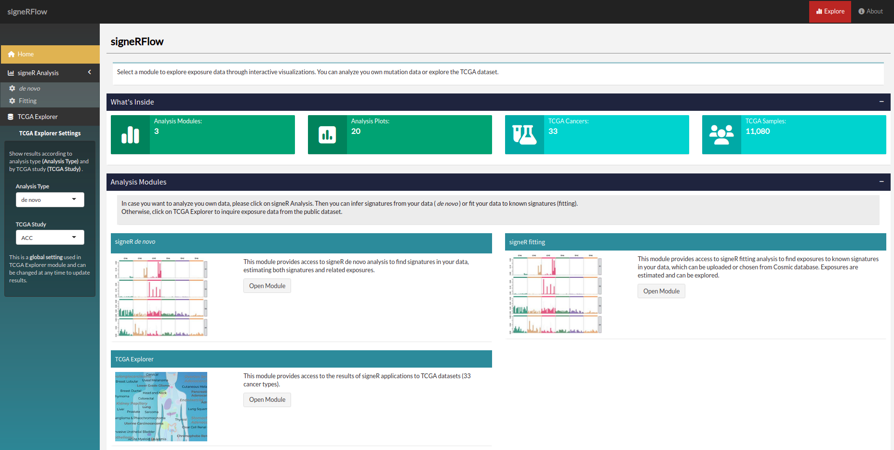
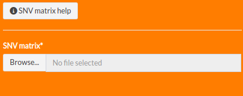
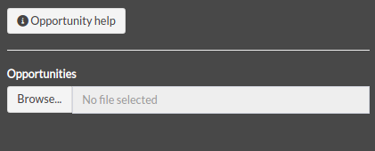
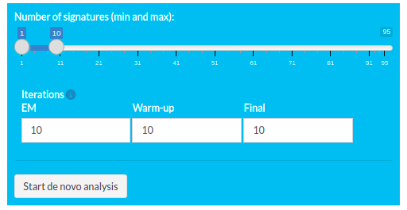

```{r setup, include=FALSE}
knitr::opts_chunk$set(
  collapse = TRUE,
  comment = "#>",
  fig.align = 'left',
  fig.height = 5,
  fig.width = 10
)
```

# Introduction

signeRFlow is a shiny app that allows users to explore mutational signatures and exposures to related mutational processes.
With the available modules, users is able to analysis theirs own data applying different approaches, such as de novo and fitting.
Also, there is module to explore public datasets from TCGA.

## Running shiny app

Start the app using either RStudio ou a terminal:
```r
signeRFlow()
```

The app should open a new window or a tab at your browser.



# Modules

There are three available modules in the app: 

 - signeR *de novo*: This module provides access to signeR *de novo* analysis to find signatures in your data, estimating both signatures and related exposures.
 - signer fitting: This module provides access to signeR fitting analysis to find exposures to known signatures in your data, which can be uploaded or chosen from Cosmic database. Exposures are estimated and can be explored.
 - TCGA explorer: This module provides access to the results of signeR applications to 33 datasets from TCGA.
 
You can go through the modules independently.

## signeR de novo

In this module, you can upload a SNV matrix with counts of mutations and execute the signeR de novo algorithm, witch computes a Bayesian approach to the non-negative factorization (NMF) of the mutation counts in a matrix product of mutational signatures and exposures to mutational processes. 

You can also provide a file with opportunities that are used as weights for the factorization. Further analysis parameters can be set, results can be visualized on different plots and found signatures can be compared to the ones in Cosmic database interactively.

### Load data

You can upload a SNV matrix file (mandatory) with your own samples to use in signeR *de novo* module. You can upload an opportunity file as well. 

#### SNV Matrix

You can upload a SNV matrix file from your computer by clicking at the *Browse button*.



SNV matrix is a text file with a (tab-delimited) matrix of SNV counts found on analysed genomes. It must contain one row for each genome sample and 97 columns, the first one with sample ids and, after that, one column for each mutation type. Mutations should be specified in the column names (headers), by both the base change and the trinucleotide context were it occurs (for example: C>A:ACA). The table below shows a example of the SNV matrix structure.

<table class="table table-striped table-hover" style="margin-left: auto; margin-right: auto;">
 <thead>
  <tr>
   <th style="text-align:left;"> </th>
   <th style="text-align:left;"> C>A:ACA </th>
   <th style="text-align:left;"> C>A:ACC </th>
   <th style="text-align:left;"> C>A:ACG </th>
   <th style="text-align:left;"> C>A:ACT </th>
   <th style="text-align:left;"> C>A:CCA </th>
   <th style="text-align:left;"> ... </th>
   <th style="text-align:left;"> T>G:TTT </th>
  </tr>
 </thead>
<tbody>
  <tr>
   <td style="text-align:left;"> PD3851a </td>
   <td style="text-align:left;"> 31 </td>
   <td style="text-align:left;"> 34 </td>
   <td style="text-align:left;"> 9 </td>
   <td style="text-align:left;"> 21 </td>
   <td style="text-align:left;"> 24 </td>
   <td style="text-align:left;"> ... </td>
   <td style="text-align:left;"> 21 </td>
  </tr>
  <tr>
   <td style="text-align:left;"> PD3904a </td>
   <td style="text-align:left;"> 110 </td>
   <td style="text-align:left;"> 91 </td>
   <td style="text-align:left;"> 9 </td>
   <td style="text-align:left;"> 87 </td>
   <td style="text-align:left;"> 108 </td>
   <td style="text-align:left;"> ... </td>
   <td style="text-align:left;"> 77 </td>
  </tr>
  <tr>
   <td style="text-align:left;"> ... </td>
   <td style="text-align:left;"> ... </td>
   <td style="text-align:left;"> ... </td>
   <td style="text-align:left;"> ... </td>
   <td style="text-align:left;"> ... </td>
   <td style="text-align:left;"> ... </td>
   <td style="text-align:left;"> ... </td>
   <td style="text-align:left;"> ... </td>
  </tr>
  <tr>
   <td style="text-align:left;"> PD3890a </td>
   <td style="text-align:left;"> 122 </td>
   <td style="text-align:left;"> 112 </td>
   <td style="text-align:left;"> 13 </td>
   <td style="text-align:left;"> 107 </td>
   <td style="text-align:left;"> 99 </td>
   <td style="text-align:left;"> ... </td>
   <td style="text-align:left;"> 50 </td>
  </tr>
</tbody>
</table>

You can create a SNV matrix from VCF using the method 
```r
genCountMatrixFromVcf
```
from signeR package. See the [documentation](https://bioconductor.org/packages/release/bioc/vignettes/signeR/inst/doc/signeR-vignette.html#toc3) for more details. 

**Columns:**

The first columnn needs to contain the sample ID and other columns contain the 96 trinucleotide contexts.

**Rows:**

Each row contain the sample ID and the counts for each trinucleotide contexts.

**Example file:**

[21 breast cancer](https://raw.githubusercontent.com/rvalieris/signeR/master/inst/extdata/21_breast_cancers.mutations.txt)

#### Opportunity matrix

You can upload a Opportunity matrix file from your computer by clicking at the *Browse button*.



Opportunity matrix is a tab-delimited text file with a matrix of counts of trinucleotide contexts found in studied genomes. It must structured as the SNV matrix, with mutations specified on the head line (for each SNV count, the Opportunity matrix shows the total number of genomic loci where the refereed mutation could have occurred). The table below shows a example of the opportunity matrix structure.

<table class="table table-striped table-hover" style="margin-left: auto; margin-right: auto;">
 <thead>
  <tr>
   <th style="text-align:left;"> 366199887 </th>
   <th style="text-align:left;"> 211452373 </th>
   <th style="text-align:left;"> 45626142 </th>
   <th style="text-align:left;"> 292410567 </th>
   <th style="text-align:left;"> 335391892 </th>
   <th style="text-align:left;"> 239339768 </th>
   <th style="text-align:left;"> ... </th>
   <th style="text-align:left;"> 50233875 </th>
  </tr>
 </thead>
<tbody>
  <tr>
   <td style="text-align:left;"> 202227618 </td>
   <td style="text-align:left;"> 116207171 </td>
   <td style="text-align:left;"> 25138239 </td>
   <td style="text-align:left;"> 161279580 </td>
   <td style="text-align:left;"> 184193767 </td>
   <td style="text-align:left;"> 131051208 </td>
   <td style="text-align:left;"> ... </td>
   <td style="text-align:left;"> 177385805 </td>
  </tr>
  <tr>
   <td style="text-align:left;"> 225505378 </td>
   <td style="text-align:left;"> 130255706 </td>
   <td style="text-align:left;"> 28152934 </td>
   <td style="text-align:left;"> 179996700 </td>
   <td style="text-align:left;"> 206678032 </td>
   <td style="text-align:left;"> 147634427 </td>
   <td style="text-align:left;"> ... </td>
   <td style="text-align:left;"> 199062504 </td>
  </tr>
  <tr>
   <td style="text-align:left;"> 425545790 </td>
   <td style="text-align:left;"> 245523433 </td>
   <td style="text-align:left;"> 53437284 </td>
   <td style="text-align:left;"> 339065644 </td>
   <td style="text-align:left;"> 389386002 </td>
   <td style="text-align:left;"> 278770926 </td>
   <td style="text-align:left;"> ... </td>
   <td style="text-align:left;"> 375075216 </td>
  </tr>
  <tr>
   <td style="text-align:left;"> 452332390 </td>
   <td style="text-align:left;"> 259934779 </td>
   <td style="text-align:left;"> 55862550 </td>
   <td style="text-align:left;"> 361010972 </td>
   <td style="text-align:left;"> 412168035 </td>
   <td style="text-align:left;"> 292805460 </td>
   <td style="text-align:left;"> ... </td>
   <td style="text-align:left;"> 396657807 </td>
  </tr>
</tbody>
</table>

You can create a opportunity matrix from the reference genome using the method 
```r
genOpportunityFromGenome
```
from signeR package. See the [documentation](https://bioconductor.org/packages/release/bioc/vignettes/signeR/inst/doc/signeR-vignette.html#toc3) for more details. 

**Columns:**

There is no header in this file and each column represents a trinucleotide context.

**Rows:**

Each row contains the count frequency of the trinucleotides in the whole analyzed region for each sample.

**Example file:**

[21 breast cancer](https://raw.githubusercontent.com/rvalieris/signeR/master/inst/extdata/21_breast_cancers.opportunity.txt)

### de novo analysis

There are some parameters that you can define before running the analysis by clicking at **Start de novo analysis** button:



Parameters:

**Number of signatures**:

define the minimal and maximal numbers of signatures you want that signeR estimates.

**EM**:

number of iterations performed to estimate the hiper-hiper parameters of signeR model. Ignored if previously computed values are used for those parameters (fast option).

**Warm-up**:

number of Gibbs sampler iterations performed in warming phase, before signeR assumes that the model have converged.

**Final**:

number of final Gibbs sampler iterations used to estimate signatures and exposures.

During the execution, a message will be showed at the screen showing the progress.
After, you can download the results by clicking the button **Download Rdata** below the button **Start de novo analysis** and
can iterate with all available plots in signeR package.

### cosmic cosine

## signeR fitting

### Load data

### fitting analysis

## Downstream analysis

### Clustering

### Covariate

# TCGA Explorer

## Filter dataset

## Covariate analysis

# SessionInfo  
```{r}
sessionInfo()
```

