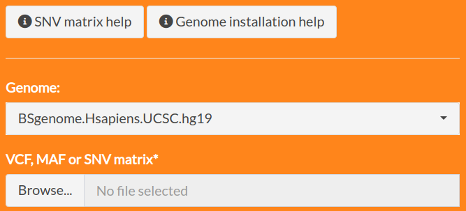
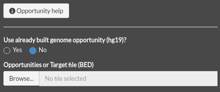
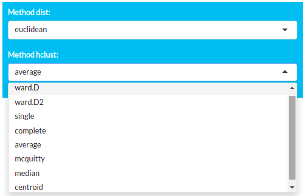
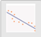
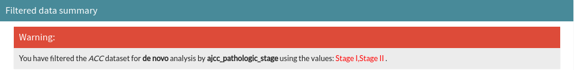

```{r setup, include=FALSE}
knitr::opts_chunk$set(
  collapse = TRUE,
  comment = "#>",
  fig.align = 'left',
  fig.height = 5,
  fig.width = 10
)
```

# Introduction

signeRFlow is a shiny app that allows users to explore mutational signatures and exposures to related mutational processes.
With the available modules, users are able to perform analysis on theirs own data applying different approaches, such as *de novo* and fitting.
Also, there is a module to explore public datasets from TCGA.

## Running shiny app

Start the app using either RStudio or a terminal:
```r
signeRFlow()
```

The app will open on a new window or on a tab at your browser.


# Modules

There are three available modules in the app: 

 - signeR *de novo*: This module provides access to signeR *de novo* analysis to find signatures in your data, estimating both signatures and related exposures.
 - signeR fitting: This module provides access to signeR fitting analysis to find exposures to known signatures in your data, which can be uploaded or chosen from Cosmic database. Exposures are estimated and can be explored.
 - TCGA explorer: This module provides access to the results of signeR applications to 33 datasets from TCGA.
 
You can go through the modules independently by using the app sidebar.

## signeR de novo

In this module, you can upload a SNV matrix with counts of mutations and execute the signeR *de novo* algorithm, which computes a Bayesian approach to the non-negative factorization (NMF) of the mutation counts in a matrix product of mutational signatures and exposures to mutational processes. 

You can also provide a file with opportunities that are used as weights for the factorization. Further analysis parameters can be set, results can be visualized on different plots and found signatures can be compared to the ones in Cosmic database interactively.

### Load data

You can upload a SNV matrix file (mandatory) with your own samples to use in signeR *de novo* module. You can upload an opportunity file as well. 

#### SNV Matrix

You can upload a SNV matrix file from your computer by clicking at the *Browse button*.



SNV matrix is a text file with a (tab-delimited) matrix of SNV counts found on analyzed genomes. It must contain one row for each genome sample and 97 columns, the first one with sample ids and, after that, one column for each mutation type. Mutations should be specified in the column names (headers), by both the base change and the trinucleotide context were it occurs (for example: C>A:ACA). The table below shows a example of the SNV matrix structure.

<table class="table table-striped table-hover" style="margin-left: auto; margin-right: auto;">
 <thead>
  <tr>
   <th style="text-align:left;"> </th>
   <th style="text-align:left;"> C>A:ACA </th>
   <th style="text-align:left;"> C>A:ACC </th>
   <th style="text-align:left;"> C>A:ACG </th>
   <th style="text-align:left;"> C>A:ACT </th>
   <th style="text-align:left;"> C>A:CCA </th>
   <th style="text-align:left;"> ... </th>
   <th style="text-align:left;"> T>G:TTT </th>
  </tr>
 </thead>
<tbody>
  <tr>
   <td style="text-align:left;"> PD3851a </td>
   <td style="text-align:left;"> 31 </td>
   <td style="text-align:left;"> 34 </td>
   <td style="text-align:left;"> 9 </td>
   <td style="text-align:left;"> 21 </td>
   <td style="text-align:left;"> 24 </td>
   <td style="text-align:left;"> ... </td>
   <td style="text-align:left;"> 21 </td>
  </tr>
  <tr>
   <td style="text-align:left;"> PD3904a </td>
   <td style="text-align:left;"> 110 </td>
   <td style="text-align:left;"> 91 </td>
   <td style="text-align:left;"> 9 </td>
   <td style="text-align:left;"> 87 </td>
   <td style="text-align:left;"> 108 </td>
   <td style="text-align:left;"> ... </td>
   <td style="text-align:left;"> 77 </td>
  </tr>
  <tr>
   <td style="text-align:left;"> ... </td>
   <td style="text-align:left;"> ... </td>
   <td style="text-align:left;"> ... </td>
   <td style="text-align:left;"> ... </td>
   <td style="text-align:left;"> ... </td>
   <td style="text-align:left;"> ... </td>
   <td style="text-align:left;"> ... </td>
   <td style="text-align:left;"> ... </td>
  </tr>
  <tr>
   <td style="text-align:left;"> PD3890a </td>
   <td style="text-align:left;"> 122 </td>
   <td style="text-align:left;"> 112 </td>
   <td style="text-align:left;"> 13 </td>
   <td style="text-align:left;"> 107 </td>
   <td style="text-align:left;"> 99 </td>
   <td style="text-align:left;"> ... </td>
   <td style="text-align:left;"> 50 </td>
  </tr>
</tbody>
</table>

You can generate a SNV matrix from VCF using the method:
```r
genCountMatrixFromVcf
```
from signeR package. See the [documentation](https://bioconductor.org/packages/release/bioc/vignettes/signeR/inst/doc/signeR-vignette.html#toc3) for more details. 

**Columns:**

The first column needs to contain the sample ID and other columns contain the 96 trinucleotide contexts.

**Rows:**

Each row contain the sample ID and the counts for each trinucleotide contexts.

**Example file:**

[21 breast cancer](https://raw.githubusercontent.com/rvalieris/signeR/master/inst/extdata/21_breast_cancers.mutations.txt)

#### Opportunity matrix

You can upload an Opportunity matrix file from your computer by clicking at the *Browse button*. This is an optional file.



Opportunity matrix is a tab-delimited text file with a matrix of counts of trinucleotide contexts found in studied genomes. It must structured as the SNV matrix, with mutations specified on the head line (for each SNV count, the Opportunity matrix shows the total number of genomic loci where the refereed mutation could have occurred). The table below shows a example of the opportunity matrix structure.

<table class="table table-striped table-hover" style="margin-left: auto; margin-right: auto;">
 <thead>
  <tr>
   <th style="text-align:left;"> 366199887 </th>
   <th style="text-align:left;"> 211452373 </th>
   <th style="text-align:left;"> 45626142 </th>
   <th style="text-align:left;"> 292410567 </th>
   <th style="text-align:left;"> 335391892 </th>
   <th style="text-align:left;"> 239339768 </th>
   <th style="text-align:left;"> ... </th>
   <th style="text-align:left;"> 50233875 </th>
  </tr>
 </thead>
<tbody>
  <tr>
   <td style="text-align:left;"> 202227618 </td>
   <td style="text-align:left;"> 116207171 </td>
   <td style="text-align:left;"> 25138239 </td>
   <td style="text-align:left;"> 161279580 </td>
   <td style="text-align:left;"> 184193767 </td>
   <td style="text-align:left;"> 131051208 </td>
   <td style="text-align:left;"> ... </td>
   <td style="text-align:left;"> 177385805 </td>
  </tr>
  <tr>
   <td style="text-align:left;"> 225505378 </td>
   <td style="text-align:left;"> 130255706 </td>
   <td style="text-align:left;"> 28152934 </td>
   <td style="text-align:left;"> 179996700 </td>
   <td style="text-align:left;"> 206678032 </td>
   <td style="text-align:left;"> 147634427 </td>
   <td style="text-align:left;"> ... </td>
   <td style="text-align:left;"> 199062504 </td>
  </tr>
  <tr>
   <td style="text-align:left;"> 425545790 </td>
   <td style="text-align:left;"> 245523433 </td>
   <td style="text-align:left;"> 53437284 </td>
   <td style="text-align:left;"> 339065644 </td>
   <td style="text-align:left;"> 389386002 </td>
   <td style="text-align:left;"> 278770926 </td>
   <td style="text-align:left;"> ... </td>
   <td style="text-align:left;"> 375075216 </td>
  </tr>
  <tr>
   <td style="text-align:left;"> 452332390 </td>
   <td style="text-align:left;"> 259934779 </td>
   <td style="text-align:left;"> 55862550 </td>
   <td style="text-align:left;"> 361010972 </td>
   <td style="text-align:left;"> 412168035 </td>
   <td style="text-align:left;"> 292805460 </td>
   <td style="text-align:left;"> ... </td>
   <td style="text-align:left;"> 396657807 </td>
  </tr>
</tbody>
</table>

You can create a opportunity matrix from the reference genome using the method:
```r
genOpportunityFromGenome
```
from signeR package. See the [documentation](https://bioconductor.org/packages/release/bioc/vignettes/signeR/inst/doc/signeR-vignette.html#toc3) for more details. 

**Columns:**

There is no header in this file and each column represents a trinucleotide context.

**Rows:**

Each row contains the count frequency of the trinucleotides in the whole analyzed region for each sample.

**Example file:**

[21 breast cancer](https://raw.githubusercontent.com/rvalieris/signeR/master/inst/extdata/21_breast_cancers.opportunity.txt)

### de novo analysis

There are some parameters that you can define before running the analysis by clicking at **Start de novo analysis** button:


Parameters:

**Number of signatures**:

define the minimal and maximal numbers of signatures you want that signeR estimates.

**EM**:

number of iterations performed to estimate the hiper-hiper parameters of signeR model. Ignored if previously computed values are used for those parameters (fast option).

**Warm-up**:

number of Gibbs sampler iterations performed in warming phase, before signeR assumes that the model have converged.

**Final**:

number of final Gibbs sampler iterations used to estimate signatures and exposures.

During the execution, a message will appear at the screen showing the progress.
After, you can download the results by clicking the button **Download Rdata** below the button **Start de novo analysis** and
can iterate with all available plots in signeR package.

### cosmic cosine

signeRFlow uses COSMIC v3.2 to calculate the cosine distance between found signatures and those present in COSMIC.
A heatmap will be shown at the **COSMIC Comparison** section of *de novo* tab.

## signeR fitting

In this module, you can upload a SNV matrix with counts of mutations, the same as used on *de novo* module, and a previous signatures file with known signatures to execute the signeR fitting algorithm, witch computes a Bayesian approach to the fitting of mutation counts to known mutational signatures, thus estimating exposures to mutational processes. 

You can also provide a file with opportunities that are used as weights for the factorization. Further analysis parameters can be set and estimated exposures can be visualized on different plots interactively.

### Load data

You can upload a SNV matrix file with your own samples to use in signeR fitting module and previous known signatures (mandatories files). You can upload an opportunity file as well.

#### SNV matrix

<!-- TODO: criar um link pra lá em cima -->
This is the same file used on **de novo** module.

#### Opportunity matrix

<!-- TODO: criar um link pra lá em cima -->
This is the same file used on **de novo** module.

#### Previous signatures

You can upload a Previous signatures matrix file from your computer by clicking at the *Browse button*.


Previous signatures is a tab-delimited text file with a matrix of previously known signatures. It must contain one column for each signature and one row for each of the 96 SNV types (considering trinucleotide contexts). Mutation types should be contained on the first column, in the same form as the column names of the SNV matrix. The table below shows a example of the previous signatures matrix structure.

<table class="table table-striped table-hover" style="margin-left: auto; margin-right: auto;">
 <thead>
  <tr>
   <th style="text-align:left;"> </th>
   <th style="text-align:left;"> Signature 2 </th>
   <th style="text-align:left;"> Signature 3 </th>
   <th style="text-align:left;"> Signature 5 </th>
   <th style="text-align:left;"> Signature 6 </th>
   <th style="text-align:left;"> ... </th>
   <th style="text-align:left;"> Signature 8 </th>
  </tr>
 </thead>
<tbody>
  <tr>
   <td style="text-align:left;"> C>A:ACA </td>
   <td style="text-align:left;"> 0.01110 </td>
   <td style="text-align:left;"> 0.00067 </td>
   <td style="text-align:left;"> 0.02218 </td>
   <td style="text-align:left;"> 0.01494 </td>
   <td style="text-align:left;"> ... </td>
   <td style="text-align:left;"> 0.03672 </td>
  </tr>
  <tr>
   <td style="text-align:left;"> C>A:ACC </td>
   <td style="text-align:left;"> 0.00915 </td>
   <td style="text-align:left;"> 0.00062 </td>
   <td style="text-align:left;"> 0.01788 </td>
   <td style="text-align:left;"> 0.00896 </td>
   <td style="text-align:left;"> ... </td>
   <td style="text-align:left;"> 0.03324 </td>
  </tr>
  <tr>
   <td style="text-align:left;"> C>A:ACG </td>
   <td style="text-align:left;"> 0.00150 </td>
   <td style="text-align:left;"> 0.00010 </td>
   <td style="text-align:left;"> 0.00213 </td>
   <td style="text-align:left;"> 0.00221 </td>
   <td style="text-align:left;"> ... </td>
   <td style="text-align:left;"> 0.00252 </td>
  </tr>
  <tr>
   <td style="text-align:left;"> ... </td>
   <td style="text-align:left;"> ... </td>
   <td style="text-align:left;"> ... </td>
   <td style="text-align:left;"> ... </td>
   <td style="text-align:left;"> ... </td>
   <td style="text-align:left;"> ... </td>
   <td style="text-align:left;"> ... </td>
  </tr>
  <tr>
   <td style="text-align:left;"> T>G:TTT </td>
   <td style="text-align:left;"> 0.00403 </td>
   <td style="text-align:left;"> 2.359E-05 </td>
   <td style="text-align:left;"> 0.0130 </td>
   <td style="text-align:left;"> 0.01337 </td>
   <td style="text-align:left;"> ... </td>
   <td style="text-align:left;"> 0.00722 </td>
  </tr>
</tbody>
</table>


**Columns:**

The first column needs to contain the trinucleotide contexts and other columns contain the known signatures.

**Rows:**

Each row contains the expected frequency of the given mutation in the appointed trinucleotide context.

**Example file:**

[21 breast cancer](https://raw.githubusercontent.com/rvalieris/signeR/dev2.0/inst/extdata/Cosmic_signatures_BRC.txt)

### Fitting analysis

There are some parameters that you can define before running the analysis by clicking at **Start Fitting analysis** button:


Parameters:

**EM**:

number of iterations performed to estimate the hiper-hiper parameters of signeR model. Ignored if previously computed values are used for those parameters (fast option).

**Warm-up**:

number of Gibbs sampler iterations performed in warming phase, before signeR assumes that the model have converged.

**Final**:

number of final Gibbs sampler iterations used to estimate signatures and exposures.

During the execution, a message will appear at the screen showing the progress.
After, you can download the results by clicking the button **Download Rdata** below the button **Start Fitting analysis** and
can iterate with all available plots in signeR package.

## Downstream analysis

Available in all modules, you can perform downstream analysis using *de novo* or fitting results with your own data, or in the TCGA Explorer module.

There are two main downstream analysis:

  - **Clustering**
    - *Hierarchical Clustering*: signeRFlow generates a dendogram for each generated sample of the exposure matrix. Consensus results, i.e. branches that are recurrently found, are reported. Different distance metrics and clustering algorithms are available to be selected.
    - *Fuzzy Clustering*: signeRFlow can apply the Fuzzy C-Means Clustering on each generated sample of the exposure matrix. Pertinence levels of samples to clusters are averaged over different runs of the algorithm. Means are considered as the final pertinence levels and are shown in a heatmap.
  - **Covariate**
    - *Categorical feature*: differences in exposures among groups can be analyzed and if some of the samples are unlabeled they can be labeled based on the similarity of their exposure profiles to those of labeled samples.
    - *Continuous feature*: its correlation to estimated exposures can be evaluated.
    - *Survival feature*: survival data can also be analyzed and the relation of signatures to survival can be accessed. 

You can access those analysis in all modules using the tabs *Clustering* and *Covariate*.

### Clustering

**Hierarchical Clustering**

By using the Hierarchical clustering section, you can select different dist and hclust methods:




When you select a new dist or hclust method, the dendogram plot is updated.

**Fuzzy Clustering**

By using the Fuzzy clustering section, you can set the number of groups or let the algorithm to estimate (Set groups to 1) and click at the **Run fuzzy** to start the analysis:


During the execution, a message will be showed at the screen showing the progress.

> Warning:
> Fuzzy clustering can be a long process and demands high computer resources.

The output of Fuzzy clustering is shown as a heatmap plot.

### Covariate

To perform a Covariate analysis on signeRFlow, you must upload a clinical data, a tab-delimited file with samples in rows and features in columns. You can upload a file by clicking in the **Browse...** button:


Clinical data is a tab-delimited text file with a matrix of available metadata (clinical and/or survival) for each sample. It must have a first column of sample ids, named as **"SampleID"**, whose entries match the row names of the **SNV matrix**. The number and title of the remaining columns are optional, however if **survival** data is included it must be organized in a column named **time** (in months) and another named **status** (which contains 1 for death events and 0 for censored samples). The table below shows a example of the clinical data matrix structure.

<table class="table table-striped table-hover" style="margin-left: auto; margin-right: auto;">
 <thead>
  <tr>
   <th style="text-align:left;"> SampleID </th>
   <th style="text-align:left;"> gender </th>
   <th style="text-align:left;"> ajcc_pathologic_stage </th>
   <th style="text-align:left;"> ethnicity </th>
   <th style="text-align:left;"> race </th>
   <th style="text-align:left;"> status </th>
   <th style="text-align:left;"> time </th>
  </tr>
 </thead>
<tbody>
  <tr>
   <td style="text-align:left;"> PD3851a </td>
   <td style="text-align:left;"> male </td>
   <td style="text-align:left;"> Stage I </td>
   <td style="text-align:left;"> not hispanic or latino </td>
   <td style="text-align:left;"> white </td>
   <td style="text-align:left;"> 0 </td>
   <td style="text-align:left;"> 236 </td>
  </tr>
  <tr>
   <td style="text-align:left;"> PD3890a </td>
   <td style="text-align:left;"> male </td>
   <td style="text-align:left;"> Stage II </td>
   <td style="text-align:left;"> not hispanic or latino </td>
   <td style="text-align:left;"> black or african american </td>
   <td style="text-align:left;"> 1 </td>
   <td style="text-align:left;"> 199 </td>
  </tr>
  <tr>
   <td style="text-align:left;"> PD3904a </td>
   <td style="text-align:left;"> female </td>
   <td style="text-align:left;"> Stage II </td>
   <td style="text-align:left;"> NA </td>
   <td style="text-align:left;"> NA </td>
   <td style="text-align:left;"> 0 </td>
   <td style="text-align:left;"> 745 </td>
  </tr>
  <tr>
   <td style="text-align:left;"> PD3905a </td>
   <td style="text-align:left;"> female </td>
   <td style="text-align:left;"> Stage IV </td>
   <td style="text-align:left;"> NA </td>
   <td style="text-align:left;"> white </td>
   <td style="text-align:left;"> 1 </td>
   <td style="text-align:left;"> 299 </td>
  </tr>
  <tr>
   <td style="text-align:left;"> PD3945a </td>
   <td style="text-align:left;"> male </td>
   <td style="text-align:left;"> Stage IV </td>
   <td style="text-align:left;"> not hispanic or latino </td>
   <td style="text-align:left;"> asian </td>
   <td style="text-align:left;"> 0 </td>
   <td style="text-align:left;"> 799 </td>
  </tr>
</tbody>
</table>


**Columns:**

The first column must contains the sample ID. Other columns may contain sample groupings or other features that you would like to co-analyze with exposure data.

**Rows:**

Each row contains clinical information for one sample: its ID and all other data of interest.

**Example file:**

[21 breast cancer](https://raw.githubusercontent.com/rvalieris/signeR/dev2.0/inst/extdata/clinical-test-signerflow.tsv)

After the upload, a description table summarizes the data with all the features in rows, and the class, counts and missing for each feature.
By selecting a feature (row) at the table, a small panel is shown next to the table summarizing the values, categorical or continuous, for the selected feature:


According to the class of the feature, a set of analysis are available in the **Plots** section:

  - *Categorical feature*:
    
     
    **Differential Exposure Analysis**: highlight signatures that are differentially active among groups of samples.
    
     
    **Sample Classification**: classify samples based on their exposures to mutational processes.
  
  - *Numeric feature*:
  
     
    **Correlation Analysis**: evaluate feature correlation to exposures to mutational signatures.
    
     
    **Linear Regression**: relevance of exposures in final model of provided feature.
  
  - *Survival feature*:
  
     
    **Survival analysis**: evaluate the effect of exposure on survival.
    
     
    **Cox Regression**: evaluate the combined effect on survival of exposure levels to different signatures.


Some analysis also offer few parameters to perform the analysis.

# TCGA Explorer

Instead of uploading a private dataset, signeRFlow allows you to explore exposure data previously estimated for samples on TCGA public datasets.
We executed signeR algorithm previously applied to genome samples from 33 cancer types and estimated mutational signatures and exposures were obtained for each cancer type.
Also, known signatures from Cosmic database were fitted to TCGA mutation data, thus estimating related exposures on each cancer type.

You can select the cancer type of interest and the analysis type on the sidebar. Also, samples can be filtered according to available features in the metadata. 

 

The first time you click in the button **TCGA Explorer** on the sidebar, signeRFlow will download all the necessary files (RData) according to cancer study and analysis type.

> Warning:
> The files are often small, but depends on the cancer study, this process can take a while. A message will show the download and rendering progress.

## Filter dataset

Using the data summary table with all clinical data features downloaded from TCGA, you can select a feature to filter the dataset. According to the feature class, different options to filter will be shown.

It is not mandatory to filter the dataset, you can use all the cases. The aim of this resource is to allow you to explore the dataset and select the cases you work with. 

> Note:
> If you filter a dataset using the data summary table, it will be used on the downstream analysis, such as clustering and covariate.

As an example, we selected the feature *ajcc_pathologic_stage* from ACC cancer type and *de novo* analysis:

 

and applied the filter on the dataset, selecting only groups Stage I and Stage II:

 

For each change on feature and filters, the available plots are updated according to the filtered samples.

## Covariate analysis

Similar to signeR analysis modules, the downstream analysis **Clustering** and **Covariate** are available on TCGA Explorer module and work the same, but you do not need to upload a clinical data in this module.

As a reminder, in the top of **Covariate** tab you will see an information about the dataset and used filters.

 

You can select a feature in the data summary table and perform a covariate analysis according to feature class.

# SessionInfo  
```{r}
sessionInfo()
```

